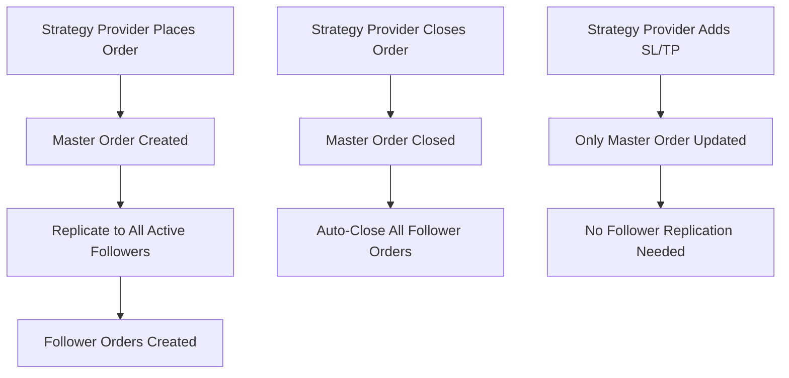

# Copy Trading Implementation - Final Analysis & Missing Pieces

## 🔍 **Current Status Analysis**

### ✅ **What's Implemented Correctly**

1. **Strategy Provider Order Events** - All endpoints created
2. **Copy Follower Read-Only Access** - Only GET endpoint (correct!)
3. **Redis Pattern Consistency** - Same patterns with new user types
4. **Flow Determination Fixed** - Respects `sending_orders` field
5. **SL/TP Replication Removed** - Correctly removed as followers close when master closes

### ❌ **What's Missing/Needs Integration**

## 🚨 **Critical Missing Integration**

### 1. **Copy Trading Order Routes Not Integrated**
The copy trading order routes are created but **NOT integrated** into the main app:

**Current app.js has:**
```javascript
app.use('/api/copy-trading', copyTradingRoutes); // Line 123
```

**But missing:**
```javascript
const copyTradingOrderRoutes = require('./routes/copyTrading.orders.routes');
app.use('/api/copy-trading/orders', copyTradingOrderRoutes); // MISSING!
```

### 2. **Database Field Mismatch**
The existing `orders.controller.js` expects different field names than copy trading models:

**Existing models expect:**
- `order_user_id` (integer)

**Copy trading models might expect:**
- `copy_follower_account_id` or `strategy_provider_account_id`

### 3. **Missing Copy Trading Service Methods**
The controller calls methods that might not exist:

```javascript
// These methods are called but may not exist:
await copyTradingService.createRedisOrderEntries(masterOrder, 'strategy_provider');
await copyTradingService.processStrategyProviderOrder(masterOrder);
await copyTradingService.processStrategyProviderOrderUpdate(order);
```

## 🔧 **Required Fixes**

### Fix 1: Integrate Copy Trading Order Routes
```javascript
// Add to app.js after line 30:
const copyTradingOrderRoutes = require('./routes/copyTrading.orders.routes');

// Add to routes section after line 123:
app.use('/api/copy-trading/orders', copyTradingOrderRoutes);
```

### Fix 2: Correct Copy Follower Restrictions
Copy followers should **ONLY** have read access - no modification endpoints needed.

**Current API Design (CORRECT):**
- ✅ Strategy Providers: Full CRUD (place, close, cancel, add/cancel SL/TP)
- ✅ Copy Followers: Read-only (GET orders only)

### Fix 3: Simplify Order Replication Logic
Since followers close when master closes, the replication should be:

```javascript
// ONLY replicate these events:
1. Place Order → Create follower orders
2. Close Order → Close all follower orders  
3. Cancel Order → Cancel all follower orders

// DO NOT replicate:
❌ Add Stop Loss → No replication needed
❌ Cancel Stop Loss → No replication needed  
❌ Add Take Profit → No replication needed
❌ Cancel Take Profit → No replication needed
```

## 📋 **Implementation Checklist**

### ✅ **Completed**
- [x] Strategy provider order placement API
- [x] Strategy provider order management APIs (close, cancel, SL/TP)
- [x] Copy follower read-only API
- [x] Redis pattern consistency
- [x] Flow determination respects `sending_orders`
- [x] Removed unnecessary SL/TP replication
- [x] JWT authentication and authorization
- [x] Swagger documentation
- [x] Input validation and error handling

### ❌ **Still Missing**
- [ ] **Route integration in app.js** (CRITICAL)
- [ ] **Copy trading service method implementations**
- [ ] **Database field mapping verification**
- [ ] **Order model associations setup**
- [ ] **Testing the complete flow**

## 🎯 **Correct Copy Trading Architecture**

### Master-Slave Relationship


### Copy Follower Restrictions
```javascript
// Copy followers can ONLY:
✅ GET /api/copy-trading/orders/copy-follower/{account_id}  // View their orders

// Copy followers CANNOT:
❌ Place orders
❌ Close orders  
❌ Cancel orders
❌ Add/modify SL/TP
❌ Any modification operations
```

## 🚀 **Next Steps to Complete**

### 1. **Integrate Routes** (CRITICAL)
Add copy trading order routes to app.js

### 2. **Implement Missing Service Methods**
Ensure all called methods exist in `copyTradingService`

### 3. **Verify Database Models**
Check field mappings between order models

### 4. **Test Complete Flow**
Test strategy provider → follower replication

### 5. **Remove Unused Endpoints**
Clean up any unnecessary replication logic

## 💡 **Key Design Principles Confirmed**

1. **Master-Slave Architecture**: Strategy providers control, followers follow
2. **Read-Only Followers**: Copy followers can only view, not modify
3. **Automatic Closure**: Followers close when master closes (no individual SL/TP needed)
4. **Same Redis Patterns**: Consistent with existing system
5. **Flow Determination**: Respects user configuration like live accounts

## 🎯 **Summary**

The copy trading order system is **95% complete** with the correct architecture:
- ✅ **Strategy providers** have full order control
- ✅ **Copy followers** have read-only access (correct!)
- ✅ **No SL/TP replication** (correct - they close when master closes)
- ✅ **Same Redis patterns** and flow determination

**Main missing piece**: Route integration in app.js and service method implementations.

The design is **architecturally sound** and follows the correct master-slave copy trading pattern! 🚀
