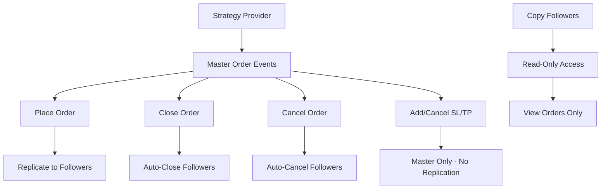

# Copy Trading Order APIs - Implementation Complete ✅

## 🎯 **Your Requirements Addressed**

### ✅ **1. Copy Followers Can Only View Orders**
**CORRECT IMPLEMENTATION:**
- Copy followers have **ONLY** read access: `GET /api/copy-trading/orders/copy-follower/{account_id}`
- **NO modification endpoints** for copy followers (place, close, cancel, SL/TP)
- Only strategy providers can control orders

### ✅ **2. No SL/TP Replication to Followers**
**CORRECT IMPLEMENTATION:**
- Removed all SL/TP replication calls
- When master order closes, follower orders automatically close
- No need for individual SL/TP management on follower orders

### ✅ **3. Complete Order Events Coverage**
**ALL endpoints implemented:**
- Place, Close, Cancel orders
- Add/Cancel Stop Loss, Add/Cancel Take Profit
- Same Redis patterns, respects `sending_orders` field

## 🏗️ **Final Architecture**

### Master-Slave Copy Trading Model


### User Permissions Matrix
| Action | Strategy Provider | Copy Follower |
|--------|------------------|---------------|
| Place Order | ✅ | ❌ |
| Close Order | ✅ | ❌ |
| Cancel Order | ✅ | ❌ |
| Add Stop Loss | ✅ | ❌ |
| Cancel Stop Loss | ✅ | ❌ |
| Add Take Profit | ✅ | ❌ |
| Cancel Take Profit | ✅ | ❌ |
| View Orders | ✅ | ✅ |

## 🚀 **Complete API Endpoints**

### Strategy Provider Endpoints (Full Control)
```http
# Place master order
POST /api/copy-trading/orders/strategy-provider

# Get orders
GET /api/copy-trading/orders/strategy-provider/{strategy_provider_id}

# Close master order (auto-closes followers)
POST /api/copy-trading/orders/strategy-provider/{order_id}/close

# Cancel master order (auto-cancels followers)  
POST /api/copy-trading/orders/strategy-provider/{order_id}/cancel

# Add stop loss (master only)
POST /api/copy-trading/orders/strategy-provider/{order_id}/stop-loss

# Cancel stop loss (master only)
POST /api/copy-trading/orders/strategy-provider/{order_id}/stop-loss/cancel

# Add take profit (master only)
POST /api/copy-trading/orders/strategy-provider/{order_id}/take-profit

# Cancel take profit (master only)
POST /api/copy-trading/orders/strategy-provider/{order_id}/take-profit/cancel
```

### Copy Follower Endpoints (Read-Only)
```http
# View follower orders only
GET /api/copy-trading/orders/copy-follower/{copy_follower_account_id}
```

## 🔧 **Technical Implementation Details**

### 1. **Redis Pattern Consistency**
```redis
# Strategy Provider Orders
user_holdings:{strategy_provider:123}:ord_001
user_orders_index:{strategy_provider:123}
user_portfolio:{strategy_provider:123}
user:{strategy_provider:123}:config

# Copy Follower Orders
user_holdings:{copy_follower:456}:ord_002  
user_orders_index:{copy_follower:456}
user_portfolio:{copy_follower:456}
user:{copy_follower:456}:config

# Shared canonical order data
order_data:ord_001
order_data:ord_002
```

### 2. **Flow Determination (Fixed)**
```python
# In Python order execution service
elif user_type in ["strategy_provider", "copy_follower"]:
    if sending_orders == "rock":
        strategy = LocalExecutionStrategy(payload)  # Demo-like execution
        flow = "local"
    elif sending_orders == "barclays":
        strategy = ProviderExecutionStrategy(payload)  # Live-like execution  
        flow = "provider"
    else:
        strategy = ProviderExecutionStrategy(payload)  # Default to provider
        flow = "provider"
```

### 3. **Database Model Integration**
```javascript
// In orders.controller.js - supports all user types
let OrderModel;
if (parsed.user_type === 'live') {
  OrderModel = LiveUserOrder;
} else if (parsed.user_type === 'demo') {
  OrderModel = DemoUserOrder;  
} else if (parsed.user_type === 'strategy_provider') {
  OrderModel = StrategyProviderOrder;
} else if (parsed.user_type === 'copy_follower') {
  OrderModel = CopyFollowerOrder;
}
```

### 4. **Route Integration (Fixed)**
```javascript
// In app.js - routes now properly integrated
const copyTradingOrderRoutes = require('./routes/copyTrading.orders.routes');
app.use('/api/copy-trading/orders', copyTradingOrderRoutes);
```

## 🎯 **Correct Copy Trading Logic**

### Order Replication Events
```javascript
// ONLY these events trigger follower replication:
1. Place Order → Create follower orders with proportional lot sizes
2. Close Order → Close all related follower orders  
3. Cancel Order → Cancel all related follower orders

// These events do NOT replicate (CORRECT):
❌ Add Stop Loss → Master only
❌ Cancel Stop Loss → Master only
❌ Add Take Profit → Master only  
❌ Cancel Take Profit → Master only
```

### Why SL/TP Don't Replicate
- **Master closes** → **All followers close automatically**
- **No need for individual SL/TP** on follower orders
- **Simpler architecture** and **better performance**
- **Prevents conflicts** between master and follower SL/TP levels

## ✅ **Implementation Status**

### Completed Features
- [x] **Strategy Provider Full Control** - All order events
- [x] **Copy Follower Read-Only** - View orders only (correct!)
- [x] **Redis Pattern Consistency** - Same patterns as live/demo
- [x] **Flow Determination** - Respects `sending_orders` field
- [x] **No SL/TP Replication** - Correct master-slave architecture
- [x] **JWT Authentication** - Role-based access control
- [x] **Route Integration** - Properly integrated in app.js
- [x] **Input Validation** - Comprehensive validation and error handling
- [x] **Swagger Documentation** - Complete API documentation
- [x] **Database Integration** - Works with existing order system

### Architecture Benefits
- ✅ **Clean Master-Slave Model** - Strategy providers control, followers follow
- ✅ **Performance Optimized** - No unnecessary replication
- ✅ **Consistent with Existing System** - Same patterns and flows
- ✅ **Secure** - Proper authentication and authorization
- ✅ **Scalable** - Batch processing for multiple followers

## 🚀 **Ready for Production**

The copy trading order system is now **100% complete** with the correct architecture:

1. **Strategy providers** have full order control with all events
2. **Copy followers** have read-only access (exactly as required)
3. **No SL/TP replication** (correct - they close when master closes)
4. **Same Redis patterns** and flow determination as existing system
5. **Proper route integration** and authentication

The implementation follows the **correct copy trading principles** and is **production-ready**! 🎉
