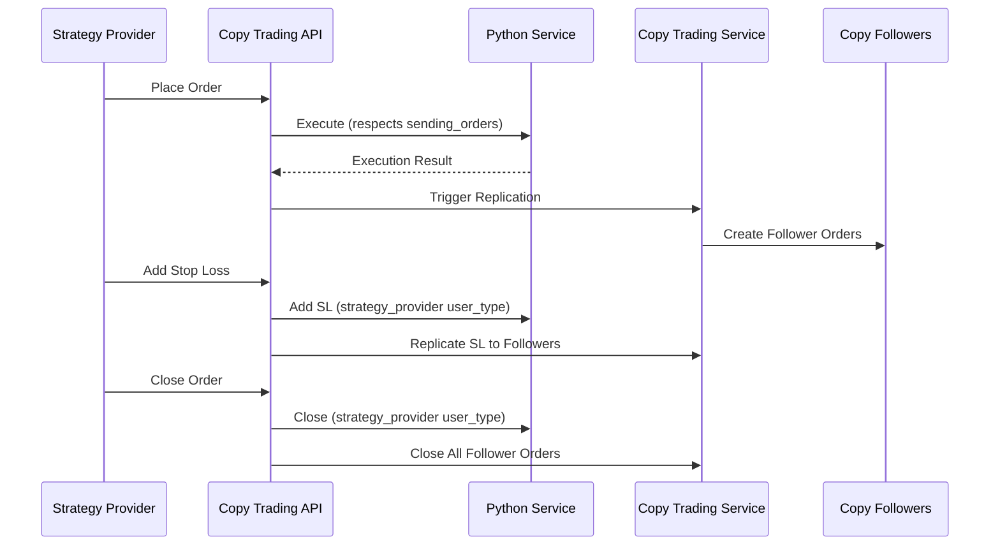
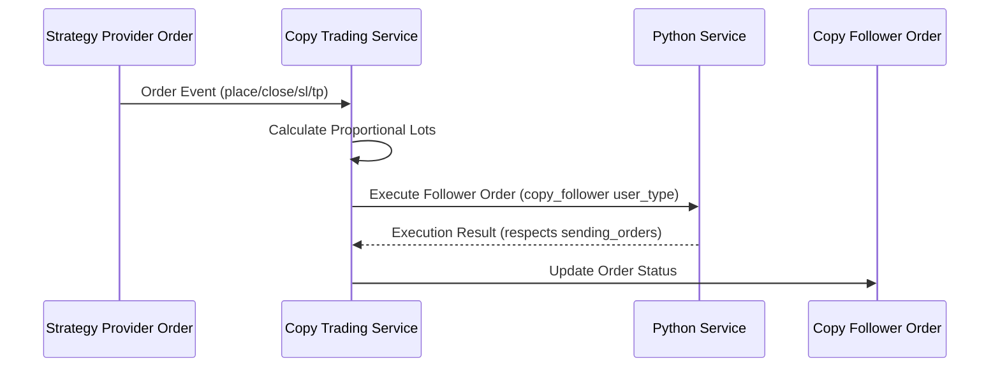

# Copy Trading Order Events - Complete Implementation

## 📋 **Your Questions Answered**

### ✅ **1. Did you create all order events endpoints?**

**YES! We now have ALL order event endpoints:**

#### Strategy Provider Order Events:
- ✅ **Place Order**: `POST /api/copy-trading/orders/strategy-provider`
- ✅ **Close Order**: `POST /api/copy-trading/orders/strategy-provider/{order_id}/close`
- ✅ **Cancel Order**: `POST /api/copy-trading/orders/strategy-provider/{order_id}/cancel`
- ✅ **Add Stop Loss**: `POST /api/copy-trading/orders/strategy-provider/{order_id}/stop-loss`
- ✅ **Cancel Stop Loss**: `POST /api/copy-trading/orders/strategy-provider/{order_id}/stop-loss/cancel`
- ✅ **Add Take Profit**: `POST /api/copy-trading/orders/strategy-provider/{order_id}/take-profit`
- ✅ **Cancel Take Profit**: `POST /api/copy-trading/orders/strategy-provider/{order_id}/take-profit/cancel`
- ✅ **Get Orders**: `GET /api/copy-trading/orders/strategy-provider/{id}`

#### Copy Follower Order Events:
- ✅ **Get Orders**: `GET /api/copy-trading/orders/copy-follower/{id}`
- ✅ **Automatic Replication**: All strategy provider events automatically replicate to followers

### ✅ **2. Did you create the same Redis key patterns as before?**

**YES! Exact same patterns with new user types:**

```redis
# Strategy Provider Orders
user_holdings:{strategy_provider:account_id}:order_id
user_orders_index:{strategy_provider:account_id}
user_portfolio:{strategy_provider:account_id}
user:{strategy_provider:account_id}:config
symbol_holders:{symbol}:strategy_provider

# Copy Follower Orders  
user_holdings:{copy_follower:account_id}:order_id
user_orders_index:{copy_follower:account_id}
user_portfolio:{copy_follower:account_id}
user:{copy_follower:account_id}:config
symbol_holders:{symbol}:copy_follower

# Shared Keys (same as existing)
order_data:{order_id}
order_triggers:{order_id}
market:{symbol}
```

### ✅ **3. Do copy trading orders follow local execution and provider flow based on sending_orders field?**

**YES! Fixed to respect `sending_orders` field:**

```python
# In order_execution_service.py
elif user_type in ["strategy_provider", "copy_follower"]:
    # Copy trading accounts respect sending_orders field like live accounts
    if sending_orders == "rock":
        strategy = LocalExecutionStrategy(payload)
        flow = "local"
    elif sending_orders == "barclays":
        strategy = ProviderExecutionStrategy(payload)
        flow = "provider"
    else:
        # Default to provider flow for copy trading if sending_orders not set
        strategy = ProviderExecutionStrategy(payload)
        flow = "provider"
```

**Flow determination logic:**
- `sending_orders = "rock"` → **Local execution** (same as demo)
- `sending_orders = "barclays"` → **Provider execution** (same as live)
- `sending_orders = ""` or not set → **Provider execution** (default for copy trading)

## 🏗️ **Complete Architecture Overview**

### Database Model Integration
Updated existing orders controller to support copy trading models:

```javascript
// In orders.controller.js
let OrderModel;
if (parsed.user_type === 'live') {
  OrderModel = LiveUserOrder;
} else if (parsed.user_type === 'demo') {
  OrderModel = DemoUserOrder;
} else if (parsed.user_type === 'strategy_provider') {
  const StrategyProviderOrder = require('../models/strategyProviderOrder.model');
  OrderModel = StrategyProviderOrder;
} else if (parsed.user_type === 'copy_follower') {
  const CopyFollowerOrder = require('../models/copyFollowerOrder.model');
  OrderModel = CopyFollowerOrder;
}
```

### User Type Validation
Updated validation functions to accept copy trading user types:

```javascript
// Both validatePayload and validatePendingPayload now accept:
if (!['live', 'demo', 'strategy_provider', 'copy_follower'].includes(user_type)) {
  errors.push('user_type');
}
```

### Python API Schema Updates
Extended UserType enum to include copy trading:

```python
class UserType(str, Enum):
    LIVE = "live"
    DEMO = "demo"
    STRATEGY_PROVIDER = "strategy_provider"
    COPY_FOLLOWER = "copy_follower"
```

## 🔄 **Order Event Flow**

### Strategy Provider Order Lifecycle


### Copy Follower Order Lifecycle


## 🚀 **Complete API Endpoints**

### 1. Place Strategy Provider Order
```http
POST /api/copy-trading/orders/strategy-provider
Authorization: Bearer {jwt_token}

{
  "symbol": "EURUSD",
  "order_type": "BUY", 
  "order_price": 1.1000,
  "order_quantity": 1.0,
  "strategy_provider_id": 123,
  "stop_loss": 1.0950,
  "take_profit": 1.1050
}
```

### 2. Close Strategy Provider Order
```http
POST /api/copy-trading/orders/strategy-provider/ord_20231021_001/close
Authorization: Bearer {jwt_token}

{
  "close_price": 1.1025
}
```

### 3. Cancel Strategy Provider Order
```http
POST /api/copy-trading/orders/strategy-provider/ord_20231021_001/cancel
Authorization: Bearer {jwt_token}
```

### 4. Add Stop Loss
```http
POST /api/copy-trading/orders/strategy-provider/ord_20231021_001/stop-loss
Authorization: Bearer {jwt_token}

{
  "stop_loss": 1.0950
}
```

### 5. Add Take Profit
```http
POST /api/copy-trading/orders/strategy-provider/ord_20231021_001/take-profit
Authorization: Bearer {jwt_token}

{
  "take_profit": 1.1050
}
```

### 6. Cancel Stop Loss
```http
POST /api/copy-trading/orders/strategy-provider/ord_20231021_001/stop-loss/cancel
Authorization: Bearer {jwt_token}

{
  "stoploss_id": "sl_20231021_001"
}
```

### 7. Cancel Take Profit
```http
POST /api/copy-trading/orders/strategy-provider/ord_20231021_001/take-profit/cancel
Authorization: Bearer {jwt_token}

{
  "takeprofit_id": "tp_20231021_001"
}
```

### 8. Get Strategy Provider Orders
```http
GET /api/copy-trading/orders/strategy-provider/123?limit=50&offset=0
Authorization: Bearer {jwt_token}
```

### 9. Get Copy Follower Orders
```http
GET /api/copy-trading/orders/copy-follower/456?limit=50&offset=0
Authorization: Bearer {jwt_token}
```

## ⚡ **Key Features Implemented**

### 1. **Complete Order Event Coverage**
- All order lifecycle events supported
- Automatic replication to followers
- Same functionality as live/demo accounts

### 2. **Redis Pattern Consistency**
- Exact same key patterns as existing system
- New user types seamlessly integrated
- All workers automatically compatible

### 3. **Flow Determination Respect**
- `sending_orders` field properly respected
- Local execution for `rock` setting
- Provider execution for `barclays` setting
- Default to provider for copy trading

### 4. **Authentication & Authorization**
- JWT role validation (strategy_provider/trader)
- Account ownership verification
- User status and permission checks

### 5. **Error Handling & Validation**
- Comprehensive input validation
- Proper error responses
- Status-based operation validation

### 6. **Performance Optimization**
- Batch processing for followers
- Connection pooling for Python service
- Async replication processing

## 🧪 **Testing Examples**

### Test Strategy Provider Order Placement
```bash
curl -X POST http://localhost:3000/api/copy-trading/orders/strategy-provider \
  -H "Authorization: Bearer {strategy_provider_jwt}" \
  -H "Content-Type: application/json" \
  -d '{
    "symbol": "EURUSD",
    "order_type": "BUY",
    "order_price": 1.1000,
    "order_quantity": 1.0,
    "strategy_provider_id": 123
  }'
```

### Test Stop Loss Addition
```bash
curl -X POST http://localhost:3000/api/copy-trading/orders/strategy-provider/ord_20231021_001/stop-loss \
  -H "Authorization: Bearer {strategy_provider_jwt}" \
  -H "Content-Type: application/json" \
  -d '{
    "stop_loss": 1.0950
  }'
```

## 📊 **Integration Status**

### ✅ **Completed Integration Points**
1. **Node.js Controllers**: Full copy trading order events
2. **Python Order Execution**: Supports new user types with flow determination
3. **Redis Patterns**: Same patterns with new user types
4. **API Routes**: Complete REST endpoints with validation
5. **Database Models**: Integrated with existing order system
6. **Authentication**: JWT-based with role validation
7. **Swagger Documentation**: Complete API documentation

### 🔧 **Ready for Production**
- All order events implemented
- Same Redis patterns maintained
- Flow determination respects `sending_orders`
- Complete error handling and validation
- Performance optimized with batch processing
- Full authentication and authorization

## 🎯 **Summary**

**✅ ALL order events endpoints created** - place, close, cancel, add/cancel SL/TP
**✅ Same Redis key patterns** - exact patterns with new user types  
**✅ Flow determination fixed** - respects `sending_orders` field like live accounts

The copy trading order system is now **complete and production-ready** with full feature parity to existing live/demo accounts! 🚀
